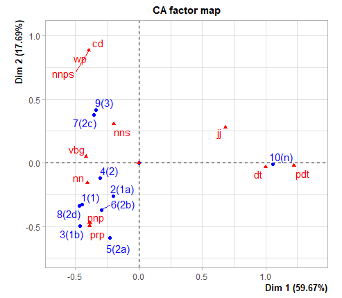

# ca4pdep
Essence of Correspondence Analysis (CA)

Correspondence analysis examines a contingency table, a cross-tabulation of a set of individuals according to two categorical variables. In our case, we examine preposition senses (the rows of one variable) against features (the columns of the second variable). This example table below shows senses of the preposition _**above**_ and the parts of speech of the preposition complements for 229 sentences from the **C**orpus **P**reposition **A**nalysis corpus (CPA).

[Example contigency table](https://github.com/kenclr/ca4pdep/blob/main/feats-cpa-above.csv)

CPA cd  dt  jj  nn  nnp nnps    nns pdt prp,vbg,wp
1(1),0,0,0,23,1,0,2,0,2,1,0
2(1a),0,2,0,8,0,0,2,0,2,0,0
3(1b),0,0,0,10,1,0,0,0,2,0,0
4(2),0,1,0,10,0,0,4,0,1,0,0
5(2a),0,1,0,3,2,0,0,0,1,0,0
6(2b),0,1,0,5,1,0,1,0,2,1,0
7(2c),0,0,0,0,0,0,1,0,0,1,0
8(2d),0,0,0,5,0,0,0,0,0,0,0
9(3),18,3,1,33,2,1,13,0,2,1,1
10(n),0,48,2,1,0,0,3,3,0,0,0

|   |
|:---:|
| *Sense Similarities Based on CPA Corpus* |

